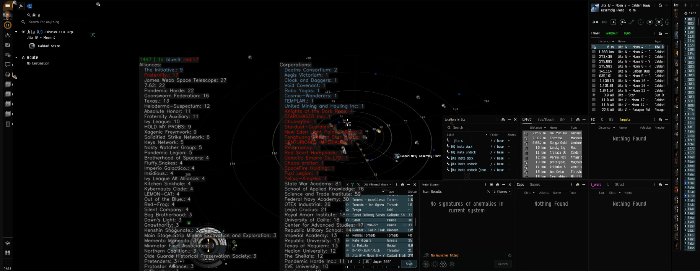

# What is this program?
This is an eve online intel tool that gives you intel "as instantly as" possible so you can make better decisions faster. 

# Features
* Able to analyze both ship dscans and looal clipboards.
* Results are returned "instantly" for 99% of dscans. This is achieved by caching most active 4 million chracters in a small built-in cache. After the initial display, live data is then retrieved and cached until the program restart.
* Results are displayed in a transparent overlay window which can be toggled on and off and this window can be moved around to a location most convenient for you.
* When the window is not in transaprent mode, you can click on individual pilot names to open their zkillboard.
* When clicking on topmost pilot count(with timer) row, it will instead redirect you to dscan.info url for the dscan you just analyzed. This can be shared with your allies.
* You can customize colors for different "danger level" of pilots and assign colors.
* You can customize colors for different corps and alliances and the aggregate mode will tally the count accordingly. By default, two alliances are setup so you that you know how to edit the config file.

# How to use?
* `alt+shift+f` - toggle transparency
    * once a window is not transparent, you can click on individual pilot names to open their zkillboard.
* `alt+shift+m` - toggle aggregated mode -> this will show you aggregated info about all pilots in your local, instead of individual info about each pilot
* `alt+shift+e` - clear cache

The shortcut keys can be customized in the config.yaml file. 

# Example usage

