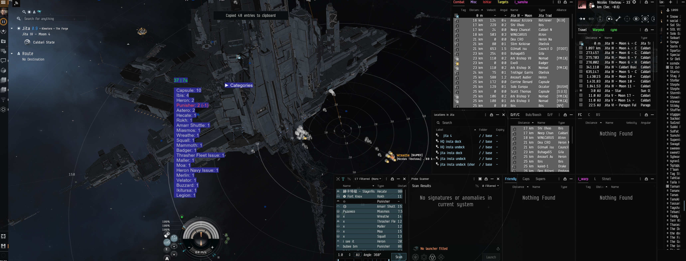

# What is this program?
This is an eve online intel tool that gives you intel "as instantly as" possible so you can make better decisions faster. 

# Features
## Dscan
* Able to analyze both ship dscans and looal clipboards.
* Results are returned "instantly" for 99% of dscans. This is achieved by caching most active 4 million chracters in a small built-in cache. After the initial display, live data is then retrieved and cached until the program restart.
* Overlay Mode: Results are displayed in a transparent overlay window that can be toggled between normal and overlay modes. In overlay mode, the window becomes click-through and the background color can be toggled for better visibility.
* UI Scale: Adjustable UI scale feature available in the top bar (0.5x to 2.0x). The scale slider automatically hides when in overlay mode for a cleaner interface.
* When the window is not in overlay mode or click through is not enabled, you can click on individual pilot/corp/alliance to open their zkillboard.
* When clicking on topmost count(with timer) row, it will instead redirect you to dscan.info url for the dscan you just analyzed. This can be shared with your allies.
* You can customize colors for different "danger level" of pilots and assign colors.
* You can customize colors for different corps and alliances and the aggregate mode will tally the count accordingly. By default, two alliances are setup so you that you know how to edit the config file. The names current used are arbitary, `blue` and `red` it can just as well be `winterco` or `imperium`. Edit the config file accordingly.

# How to use?
* `alt+shift+f` - toggle overlay mode (switches between normal window and click-through overlay)
* `alt+shift+c` - toggle click-through mode (when in overlay mode)
* `alt+shift+b` - toggle background color (for better visibility in overlay mode)
* `alt+shift+m` - toggle aggregated mode -> this will show you aggregated info about all pilots in your local, instead of individual info about each pilot
* `alt+shift+e` - clear cache

The shortcut keys can be customized in the config.yaml file. 

# Example usage

